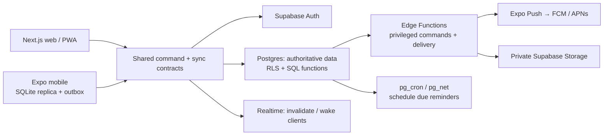

# Architecture

Last updated: 2026-08-02
Status: recommended target architecture. Phase 1C adds daily Planner Mode task commands and compact web/mobile planner surfaces on the Phase 1B authentication/read foundation. Phase 1D-C5 adds narrow mobile offline task ordering alongside task creation/editing/completion/reopening/cancellation/rescheduling; full offline replication and hosted infrastructure remain unimplemented.

## Architecture Rules Summary

This section is a quick-reference checklist of key architectural rules and
constraints. Detailed explanations follow in later sections.

### Source of truth and package direction

- PostgreSQL behind Supabase is the authoritative system of record.
- Mobile SQLite is a user-scoped read projection and durable command ledger; it
  never wins a conflict or silently writes a canonical record.
- `apps/*` may import shared `packages/*`; packages may not import application
  code.
- Domain, validation, database contracts, sync contracts, and utilities are
  framework-free. `@personal-os/api-client` alone wraps `@supabase/supabase-js`.

### Security boundaries

- Use only the public/publishable Supabase key in browser and mobile clients.
- No direct client writes to Life Days, tasks, events, sync changes, or command
  operations. Use validated command RPCs.
- Every meaningful write carries an operation ID, uses the expected revision,
  checks authenticated ownership, commits transactionally, writes redacted
  audit/task events, and emits a sync hint.
- RLS and SQL privileges are intentional. Do not grant table access merely to
  make a client or database test produce a nicer error.
- Do not include journal bodies in generic audit data or safe error messages.

### Client rules

- Web obtains all adapters from one browser-only Supabase singleton; do not
  instantiate a client in a component render, effect, or adapter factory.
- Mobile keeps its own module-level client with SecureStore session persistence.
- Expo UUIDs go through the mobile `expo-crypto` boundary; do not use browser
  `globalThis.crypto.randomUUID()` in Expo Go.

### Offline rules

- A local mutation validates through the shared command schema before storage
  and again before transmission.
- Optimistic projection and outbox insertion commit in one exclusive SQLite
  transaction. A local persistence failure rolls both back.
- An outbox entry retains its stable operation ID, user ID, command envelope,
  expected revision, safe error, sequence, target, and dependency.
- Process commands in deterministic sequence. Same-task commands wait on the
  prior command; temporary task commands wait on their create operation.
- Create acknowledgement maps a temporary ID to the server ID and rewrites
  queued dependent payloads transactionally before they can submit.
- Retry only transient/network failures. Conflicts and permanent rejections
  retain local intent in a safe issue state; never auto-rebase.
- Sign-out stops processing and clears only the signed-in user's local rows.

### Current C5 offline boundary

Local-first UI support is limited to task create, edit, reorder, complete,
reopen, cancel, and reschedule. Reorder accepts planned/in-progress/overdue
tasks and uses fractional numeric positions. Reschedule accepts planned/overdue
tasks only. Wake/sleep/repair, Top 3, unfinished resolution, cursor pull,
realtime, and broad Planner operations remain online-only.

### Product invariants

- Life Days are explicit wake-to-sleep boundaries; midnight and naps do nothing.
- A user has at most one open Life Day.
- No task rolls over automatically.
- Sleep requires explicit unfinished-task resolution.
- A Life Day has at most three active Top 3 tasks, enforced in the database.

---

## Phase 1C daily planner boundary

Planner Mode is a product interaction mode, not an authorization boundary. The web app gets its auth, Today-read, Life Day-command, and task-command adapters from one browser-only Supabase client singleton; the adapters do not create clients. Mobile uses its own module singleton with SecureStore-backed Auth persistence. On both platforms, Planner Mode calls the same typed command RPCs as the execution UI.

`tasks.is_top_three` is a small mutable task projection field. The database command layer holds a transaction advisory lock and counts active selections so no active Life Day can exceed three. Every accepted planner command increments the task revision, appends a task event, creates a redacted change summary, and emits a sync-cursor hint. No Planner Mode feature has direct table write privileges, an offline store, a realtime subscription, or a service-role key.

## Phase 1D mobile-local boundary

Phase 1D-A adds an Expo SQLite user-scoped projection, outbox ledger, temporary task-ID mapping, and a repository-backed local command engine inside `apps/mobile`. The engine validates shared command contracts and commits its optimistic projection, temporary-ID mapping, and durable command row in one exclusive SQLite transaction. Web remains online-only.

The current backend generates task IDs in `command_create_task`, so offline task creation uses a local UUID and records its create operation. Dependent queued commands retain that dependency; the Phase 1D-B processor waits for acknowledgement, replaces the temporary ID with the server ID, and rewrites dependent payloads before submission. Phase 1D-B2 initializes the projection after authenticated session restoration, reads the local snapshot, sends task-create/task-complete commands through the engine, drains when the device is reachable, and clears the signed-in user data on sign-out. Phase 1D-B3 coalesces foreground/network/manual recovery work per authenticated session, recovers stranded processing rows, and uses a transactional authoritative snapshot merge that preserves unacknowledged local task intent. Phase 1D-C1 adds task editing: each local edit advances the predicted cached revision, queues behind the prior mutation for the same task, retains its original expected revision, and remains an explicit conflict if the server rejects that revision. Phase 1D-C2 gives completed tasks the same local revision protection: reopening queues after earlier mutations, restores the local task to planned, and advances its predicted revision without rebasing a stale server version. Phase 1D-C3 applies the same rule to cancellation: only planned or in-progress tasks can be cancelled offline, the structured reason stays in the validated command envelope, and cancellation queues after all prior task mutations without revision rebasing. Phase 1D-C4 mirrors the existing `task.reschedule` RPC: only planned or overdue tasks may receive a non-null UTC instant/IANA-zone schedule; the task remains in its current Life Day, advances its predicted revision, and retains its structured reason. Phase 1D-C5 mirrors `task.reorder`: active tasks keep the existing numeric manual-position model, use fractional Move Up/Move Down positions, advance their predicted revision, retain their task dependency, and remain ordered by position, creation time, then ID through a pending authoritative refresh. In-progress unfinished-task resolution remains online-only because it is a separate server command. Wake/sleep/repair and all other Planner commands remain online-only.

## Phase 1B client boundary

`packages/api-client` is the only package that imports the Supabase JavaScript client. It validates command and read RPC responses with shared Zod schemas and supplies narrow authentication, Today-read, Life Day-command, and task-command adapters. Web uses browser session persistence; mobile uses Expo SecureStore for the Supabase Auth session and its mobile-only SQLite projection/outbox for the narrow task-create/task-edit/task-reorder/task-complete/task-reopen/task-cancel/task-reschedule path. Neither client has direct table writes, realtime subscriptions, or privileged credentials.

Phase 1B configures only local Supabase Auth for email/password sign-up and sign-in. The local CLI disables email confirmation so this narrow flow can be exercised without external email delivery. The apps consume public runtime configuration only; service-role keys remain server-only and are not configured in this repository.

## Recommendation

Use a `pnpm`-managed Turborepo with a Next.js App Router web app, an Expo React Native mobile app, framework-free TypeScript domain packages, and Supabase as the system of record. This is the recommended stack, not an unconditional commitment: it should be confirmed through a small offline-sync spike before feature development begins.

The main design constraint is that mobile offline behavior is application-owned. Supabase Realtime is useful for freshness signals, but it is not an offline database or conflict-resolution system. Expo Notifications is mobile-only; web push requires a PWA service worker and the Web Push protocol.



## Components

| Component             | Responsibility                                                                           | Recommended technology                   | Notes                                                                                                                     |
| --------------------- | ---------------------------------------------------------------------------------------- | ---------------------------------------- | ------------------------------------------------------------------------------------------------------------------------- |
| `apps/web`            | Responsive browser experience, installable PWA, authenticated shell, planner/today views | Next.js App Router + TypeScript          | Use server rendering only where it improves initial authenticated rendering; interactive/offline state is client-managed. |
| `apps/mobile`         | iOS/Android experience, local replica, local reminders, device registration              | Expo React Native + TypeScript           | Use development builds for push notifications; Expo Go is not a release test path for push.                               |
| `packages/domain`     | Entities, value objects, Zod schemas, commands, event names, time/period rules           | framework-free TypeScript                | No React, Supabase SDK, or platform APIs.                                                                                 |
| `packages/sync`       | Mutation envelope, cursor protocol, conflict result types, migration versions            | framework-free TypeScript                | The contract is shared, implementations are platform-specific.                                                            |
| `packages/api-client` | Typed authenticated calls to RPC/Edge Functions and read views                           | TypeScript                               | Does not expose service-role credentials.                                                                                 |
| `packages/config`     | ESLint, TypeScript, test, build conventions                                              | TypeScript/config                        | Add only when scaffolding the monorepo.                                                                                   |
| Web local store       | Temporary cache, outbox when web offline is enabled, journal drafts                      | IndexedDB                                | Clear on sign-out; persistent caching on shared devices should be opt-in.                                                 |
| Mobile local store    | Normalized read replica, outbox, sync cursor, notification schedule metadata             | Expo SQLite                              | Not AsyncStorage. Keep authentication/session material separately.                                                        |
| Mobile secure store   | Refresh-token/session and small device secrets only                                      | Expo SecureStore                         | Never store the replica or journal corpus here.                                                                           |
| System of record      | Data constraints, authorization, transactional commands, history, derived views          | Supabase Postgres                        | Own SQL migrations in the repository.                                                                                     |
| Authentication        | Identity, session issuance and recovery                                                  | Supabase Auth                            | Start with email magic link/passkey evaluation; exact providers are a product decision.                                   |
| Files                 | Private journal attachments and future exports                                           | Supabase Storage                         | Private bucket, signed URLs, metadata and authorization checks.                                                           |
| Server workflows      | Reminder scheduling/delivery, privileged integrations, future exports/AI                 | Supabase Edge Functions + pg_cron/pg_net | Jobs must be idempotent and observable.                                                                                   |
| Freshness             | Notify active clients that changes are available                                         | Supabase Realtime Broadcast              | Clients pull canonical changes; WebSocket events are never the sole truth.                                                |
| Notifications         | Mobile local and remote notifications                                                    | Expo Notifications + Expo Push initially | Keep provider abstraction so direct FCM/APNs remains possible.                                                            |
| Web notifications     | Browser push, if approved as a requirement                                               | Service worker + Web Push                | No web push in first functional phase; provide in-app reminder visibility first.                                          |

## Repository map

```text
personal-os/
├── AGENTS.md                         Operating and safety contract
├── README.md                         Local development and command overview
├── package.json                      Root commands, engines, development tools
├── pnpm-workspace.yaml               Workspaces and pnpm 11 build policy
├── pnpm-lock.yaml                    Locked dependency graph
├── turbo.json                        Task dependency graph
├── tsconfig.base.json                Strict shared TypeScript settings
├── eslint.config.mjs                 ESLint configuration
├── .github/workflows/verify.yml      Pull-request verification
├── .codex/                           Codex policy, secret-scan, and stop hooks
├── .agents/agents/                   Antigravity specialist definitions
├── apps/
│   ├── web/                          Next.js App Router web application
│   └── mobile/                       Expo Router mobile application
├── packages/
│   ├── api-client/                   Typed Supabase Auth/Today/RPC adapters
│   ├── config/                       Public web/mobile configuration parsing
│   ├── database-contracts/           Read-model TypeScript contracts
│   ├── domain/                       IDs, time, revisions, Life Day/task rules
│   ├── sync-contracts/               Command/result/change contracts
│   ├── utils/                        Framework-free utilities
│   └── validation/                   Shared Zod schemas
├── supabase/
│   ├── config.toml                   Local-only Supabase configuration
│   ├── migrations/                   Ordered database/RPC/RLS migrations
│   └── tests/database/               pgTAP command/RLS tests
├── scripts/                          Verification and tooling
└── docs/                             Product and technical documentation
```

### Entry points

| Surface       | Location                                                                           | Role                                              |
| ------------- | ---------------------------------------------------------------------------------- | ------------------------------------------------- |
| Web app       | `apps/web/app/page.tsx`                                                            | `/` Today route; delegates to `today-client.tsx`. |
| Web Planner   | `apps/web/app/planner/page.tsx`                                                    | `/planner`, Planner Mode.                         |
| Web health    | `apps/web/app/api/health/route.ts`                                                 | Public configuration health response.             |
| Web client    | `apps/web/lib/supabase.ts`                                                         | Browser-only, hot-reload-safe client singleton.   |
| Mobile app    | `apps/mobile` package `main: expo-router/entry`                                    | Expo Router entry.                                |
| Mobile root   | `apps/mobile/app/_layout.tsx`                                                      | Root stack.                                       |
| Mobile screen | `apps/mobile/app/index.tsx`                                                        | Authenticated Today and compact Planner Mode.     |
| Mobile client | `apps/mobile/lib/supabase.ts`                                                      | SecureStore-backed mobile client singleton.       |
| Offline core  | `apps/mobile/lib/local-store.ts`, `local-command-engine.ts`, `outbox-processor.ts` | SQLite projection/outbox and typed reconciliation.|

### Database migration order

1. `20260717000000_create_profiles.sql` — Auth profile trigger and profile RLS.
2. `20260717010000_add_life_day_today_foundation.sql` — Life Days, tasks,
   events, command operations, RLS, base command RPCs.
3. `20260718010000_add_today_read_rpcs.sql` — owner-scoped Today reads.
4. `20260718020000_add_planner_mode_task_commands.sql` — Top 3, planner RPCs,
   ordering/reopening/unfinished resolution.

### Test locations

- `packages/*/src/*.test.ts`: domain, validation, config, adapter, utility rules.
- `apps/web/lib/supabase.test.ts`: browser singleton regression.
- `apps/mobile/lib/*.test.ts`: C5 local engine, outbox/rewrite, lifecycle,
  controller, ordering, and UUID behavior.
- `supabase/tests/database/*.test.sql`: pgTAP RLS/RPC behavior.

### Important configuration

- `.env.example`, `apps/web/.env.example`, `apps/mobile/.env.example`: public
  variable names/placeholders only; never copy real values into a bundle.
- `pnpm-workspace.yaml`: pnpm 11 `allowBuilds`, explicitly denying `sharp`.
- `supabase/config.toml`: local-only API/database/Auth ports; no hosted project.
- `scripts/verify.py`: canonical six-stage non-mutating verifier.

## State ownership and dependency rules

- Postgres is authoritative for all synchronized product state, revisions, audit events, schedules, and server sync cursors.
- SQLite/IndexedDB are disposable replicas and durable outboxes, never an independent source of truth. Losing a device must not lose accepted server data.
- The `domain` and `sync` packages may not import UI frameworks, database SDKs, notification APIs, or environment variables.
- Apps may import packages; packages may not import apps.
- Direct browser/mobile database reads are restricted to user-owned, RLS-protected read models. Domain mutations go through a transactional command/RPC boundary.
- Edge Functions own service-role use. A service-role or secret key must never reach web/mobile bundles.
- Realtime only emits an invalidation/user cursor hint. Every client responds by pulling changes from the database/API.
- Derived progress views may be recalculated; immutable command, revision, and audit tables must never be retroactively rewritten except by an explicit, audited privacy-redaction process.

## Phase 1A command boundary

Phase 1A implements its lifecycle writes as `SECURITY DEFINER` Postgres RPCs with a fixed search path and an explicit `auth.uid()` ownership check. The RPCs claim an operation id, validate expected revision and state, mutate the projection, append a redacted change event and sync cursor hint, then store the canonical safe result in one database transaction. Direct client writes are denied by grants and RLS.

Implemented RPCs are `command_start_life_day`, `command_close_life_day`, `command_repair_previous_life_day`, `command_create_task`, `command_update_task`, `command_complete_task`, `command_reschedule_task`, and `command_cancel_task`. There is intentionally no TypeScript server, Supabase client, realtime subscription, local replica, or app screen in this phase.

## Authentication and authorization

Every business table has `user_id uuid not null references auth.users(id)` unless an explicit system-only table documents another owner. Enable RLS on every exposed table and view. Policies use `auth.uid() = user_id` and least-privilege grants; an Edge Function/RPC must re-check authorization before privileged actions.

Recommended access tiers:

- **Authenticated client:** read and execute only its own allowed commands; cannot access internal job tables, other user rows, service tokens, or raw audit payloads that exceed the user-facing history view.
- **Database command functions:** execute a scoped transaction, validate input/revision/device ownership, write domain projections/history/sync changes, and return canonical data.
- **Edge Function service role:** limited to delivery, receipt processing, exports, and future provider calls. It must derive the target user from trusted data, not a client-supplied user id.
- **Operations/admin:** outside first-release product scope; use dashboard controls only with explicit human authorization and audit trail.

## Sync and cross-device consistency

### Protocol

Each mutable command includes `operation_id` (UUID), `device_id`, `base_revision`, client occurrence time/time zone, payload schema version, and an idempotency key. The client writes the local optimistic projection and a durable outbox record in one local transaction.

On reconnect/foreground/periodic refresh, the client:

1. Pushes a bounded page of outbox commands to a command/sync endpoint.
2. The server authenticates, deduplicates `operation_id`, checks `base_revision` and business invariants, then atomically writes canonical rows, an immutable history event, and ordered `sync_changes`.
3. The client stores accepted canonical rows/results and marks the operation accepted, rejected, or conflicted.
4. The client pulls `sync_changes` after its cursor in pages until caught up, replacing optimistic rows with canonical revisions.
5. Realtime signals, app foreground, reconnect, and periodic refresh initiate a pull; they never mutate state directly.

The server cursor is monotonically ordered per user. Deleted records produce tombstones. Retain a tombstone until all active device cursors pass it or until the documented retention window is met. If a cursor is expired, the server returns `snapshot_required`; the client downloads a paginated scoped snapshot, replaces its replica transactionally, and replays only still-pending local commands.

### Conflict policy

Do not use blanket last-write-wins.

| Data/action                                            | Initial conflict behavior                                                                                                                                 |
| ------------------------------------------------------ | --------------------------------------------------------------------------------------------------------------------------------------------------------- |
| Task completion, wake/sleep, progress log, audit event | Append/idempotent command; preserve both attempted actions and apply a deterministic server state transition.                                             |
| Goal/project/task scalar edits                         | Optimistic revision check. Reject stale whole-record updates with canonical data and a conflict record; the UI retries selected fields after user review. |
| Journal text                                           | Save immutable revisions. A stale edit becomes a conflict with both drafts available; no automatic CRDT merge in v1.                                      |
| Ordering/reprioritization                              | Command includes the full affected sequence and base revision; server rejects stale concurrent reorder and client refreshes/retries.                      |
| Delete                                                 | Soft-delete/tombstone, never a client-side hard delete. A stale edit against a tombstone becomes recover/restore guidance.                                |

This deliberately favors explainability and history over invisible merges. Re-evaluate CRDTs or a specialist sync product only after measuring actual offline conflict rates.

## Domain event flows

### Wake

1. User confirms wake time and current/home time zone; mobile can do this offline.
2. Client submits `life_day.wake` with idempotency and one-open-day expectation.
3. Server locks/checks the user’s open Life Day, creates or returns the existing day, assigns operational date from the configured policy, emits history and sync change.
4. Today projection refreshes; the device associates subsequent execution/journal events with that Life Day.

### Sleep

1. User submits a sleep time, optional reflection, and resolution choices for unfinished tasks.
2. Server validates there is an open Life Day, closes it, records duration only when valid, emits history, and creates no implicit task duplicates.
3. The UI offers explicit defer/carry-forward commands separately; completed work remains linked to the closed day.

### Task and progress

1. Planner creates/edits/places a task or Execution Mode starts an execution session.
2. Client queues the command locally if offline; accepted server commands update the task revision, task event, progress measurement/rollup invalidation, history, and sync change in one transaction.
3. Completion is idempotent. Derived weekly/monthly/project/goal progress is calculated from accepted data, not browser counters.

### Reminder and notification

1. User saves a canonical reminder with local wall-clock intent, IANA time zone, channel, quiet-hours policy, and next occurrence.
2. App reconciles a rolling local-notification horizon for near-term offline resilience.
3. A scheduled job claims due reminders using database locks/idempotency, writes a delivery attempt, and invokes the push provider through an Edge Function.
4. Provider receipts update delivery outcome; invalid device tokens are deactivated. A sending failure is retried with bounded backoff.
5. Notification taps route to the entity; acknowledgement/action is an explicit app command. Push delivery is not proof that the task was done.

### Journal and attachments

1. Client keeps unsaved drafts locally; explicit save creates a revision command.
2. Server inserts a new journal revision and updates the entry’s current revision pointer transactionally. Generic history stores metadata, never the full journal body.
3. Attachments upload to a private storage path after authorized metadata creation; the server stores file metadata and users receive short-lived signed URLs.
4. Restore creates another revision from a selected historical revision.

### Edit history

Every accepted domain command writes an append-only `change_event` with actor, device, event type, entity reference, server time, correlation/operation id, revisions, and a redacted change summary. The UI’s visible history is a filtered projection. Full text versioning belongs to journal revisions, not generic logs.

## Deployment and operations target

Use isolated local, preview/staging, and production Supabase projects. Web may deploy to Vercel or another Next.js-capable host after a separate deployment decision; mobile uses EAS development/preview/production channels only after notification credentials and privacy review. Never share database projects or push credentials across environments.

Structured logs must include request/correlation ids and operation ids but exclude journal content, task titles where avoidable, access tokens, notification tokens, and secrets. Monitor command failure rate, outbox age, cursor lag, sync conflicts, cron duration/failure, notification receipts, database load, and storage errors.

## Stack comparison

| Choice                                    | Recommendation                              | Why                                                                                                | When to choose the alternative                                                                                                        |
| ----------------------------------------- | ------------------------------------------- | -------------------------------------------------------------------------------------------------- | ------------------------------------------------------------------------------------------------------------------------------------- |
| Turborepo + pnpm vs separate repositories | Keep Turborepo + pnpm                       | Two clients benefit from shared contracts, domain rules, and coordinated migrations.               | Separate repos only if teams/release cadences are truly independent.                                                                  |
| Next.js vs web-only Expo/React Native Web | Keep Next.js for web                        | Better web routing, SSR/PWA ecosystem, accessibility and browser ergonomics.                       | Use one Expo web app only if web is intentionally secondary and SEO/desktop productivity do not matter.                               |
| Expo vs native Swift/Kotlin               | Keep Expo                                   | Supports iOS/Android, local SQLite, notifications, and a fast TypeScript workflow.                 | Native apps only if advanced background execution, widgets, health APIs, or platform-specific notification controls become essential. |
| Supabase/Postgres vs Firebase/Firestore   | Keep Supabase/Postgres                      | Relational links, SQL analytics, transactions, RLS, history, and scheduled jobs match this domain. | Firestore if built-in offline replication dominates all other concerns and last-write-wins is acceptable.                             |
| Custom outbox sync vs PowerSync/Electric  | Start custom, spike first                   | Single-user initial scope keeps a transparent protocol tractable and avoids another vendor.        | Adopt a sync specialist if the product promises broad local-first queries, high offline volume, or real collaboration on day one.     |
| Expo Push vs direct FCM/APNs/third party  | Start Expo Push behind a provider interface | Lowest initial operational cost and integrates with Expo.                                          | Use direct/provider APIs for advanced segmentation, campaigns, web push, or provider-specific capabilities.                           |

Official implementation references: [Expo monorepos](https://docs.expo.dev/guides/monorepos/), [Expo SQLite](https://docs.expo.dev/versions/latest/sdk/sqlite/), [Expo notification behavior](https://docs.expo.dev/push-notifications/what-you-need-to-know/), [Next.js PWA guidance](https://nextjs.org/docs/app/guides/progressive-web-apps), [Supabase RLS](https://supabase.com/docs/guides/database/postgres/row-level-security), [Realtime scaling](https://supabase.com/docs/guides/realtime/subscribing-to-database-changes), and [scheduled Edge Functions](https://supabase.com/docs/guides/functions/schedule-functions).

## Principal risks

- Offline sync introduces duplicate commands, stale revisions, tombstones, initial snapshot size, and schema-upgrade risks; validate it before feature scale-out.
- Push notifications are best effort: permission denial, quiet modes, Android force-stop/exact-alarm restrictions, APNs/FCM delivery, and DST can prevent an expected alert.
- Journals and local replicas are sensitive data on a lost/shared device. Encrypt platform-supported secret material, clear local state on sign-out, minimize notification text, and decide whether E2EE is required.
- An RLS policy, view, function, or service-role mistake can expose the complete private workspace. Treat RLS tests and SQL review as release blockers.
- Append-only history, sync changes, receipts, and progress events grow without bound. Define archival/retention, indexes, and partitions before volumes become material.
- Supabase/Expo/Apple/Google availability and pricing create vendor exposure. Keep migrations, domain contracts, notification provider abstraction, and export paths portable.
- Future AI analysis risks oversharing private data and corrupting source-of-truth records. Use opt-in, least-privilege read models, redaction, auditability, and separate generated insights from user data.
