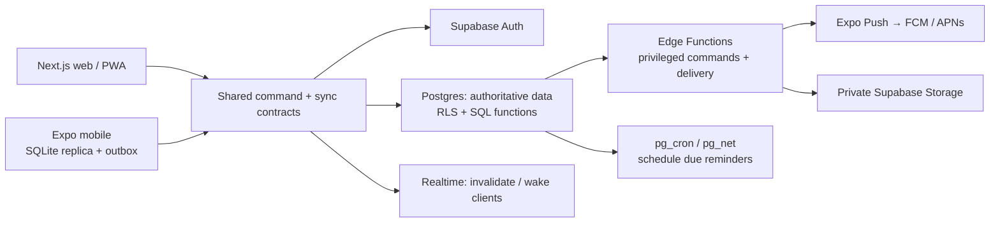

# Architecture

Last updated: 2026-07-17
Status: recommended target architecture. Phase 1A now provides local Life Day/Today database commands and shared contracts, while product screens, authentication UI, offline replication, and hosted infrastructure remain unimplemented.

## Recommendation

Use a `pnpm`-managed Turborepo with a Next.js App Router web app, an Expo React Native mobile app, framework-free TypeScript domain packages, and Supabase as the system of record. This is the recommended stack, not an unconditional commitment: it should be confirmed through a small offline-sync spike before feature development begins.

The main design constraint is that mobile offline behavior is application-owned. Supabase Realtime is useful for freshness signals, but it is not an offline database or conflict-resolution system. Expo Notifications is mobile-only; web push requires a PWA service worker and the Web Push protocol.



## Components

| Component             | Responsibility                                                                           | Recommended technology                   | Notes                                                                                                                     |
| --------------------- | ---------------------------------------------------------------------------------------- | ---------------------------------------- | ------------------------------------------------------------------------------------------------------------------------- |
| `apps/web`            | Responsive browser experience, installable PWA, authenticated shell, planner/today views | Next.js App Router + TypeScript          | Use server rendering only where it improves initial authenticated rendering; interactive/offline state is client-managed. |
| `apps/mobile`         | iOS/Android experience, local replica, local reminders, device registration              | Expo React Native + TypeScript           | Use development builds for push notifications; Expo Go is not a release test path for push.                               |
| `packages/domain`     | Entities, value objects, Zod schemas, commands, event names, time/period rules           | framework-free TypeScript                | No React, Supabase SDK, or platform APIs.                                                                                 |
| `packages/sync`       | Mutation envelope, cursor protocol, conflict result types, migration versions            | framework-free TypeScript                | The contract is shared, implementations are platform-specific.                                                            |
| `packages/api-client` | Typed authenticated calls to RPC/Edge Functions and read views                           | TypeScript                               | Does not expose service-role credentials.                                                                                 |
| `packages/config`     | ESLint, TypeScript, test, build conventions                                              | TypeScript/config                        | Add only when scaffolding the monorepo.                                                                                   |
| Web local store       | Temporary cache, outbox when web offline is enabled, journal drafts                      | IndexedDB                                | Clear on sign-out; persistent caching on shared devices should be opt-in.                                                 |
| Mobile local store    | Normalized read replica, outbox, sync cursor, notification schedule metadata             | Expo SQLite                              | Not AsyncStorage. Keep authentication/session material separately.                                                        |
| Mobile secure store   | Refresh-token/session and small device secrets only                                      | Expo SecureStore                         | Never store the replica or journal corpus here.                                                                           |
| System of record      | Data constraints, authorization, transactional commands, history, derived views          | Supabase Postgres                        | Own SQL migrations in the repository.                                                                                     |
| Authentication        | Identity, session issuance and recovery                                                  | Supabase Auth                            | Start with email magic link/passkey evaluation; exact providers are a product decision.                                   |
| Files                 | Private journal attachments and future exports                                           | Supabase Storage                         | Private bucket, signed URLs, metadata and authorization checks.                                                           |
| Server workflows      | Reminder scheduling/delivery, privileged integrations, future exports/AI                 | Supabase Edge Functions + pg_cron/pg_net | Jobs must be idempotent and observable.                                                                                   |
| Freshness             | Notify active clients that changes are available                                         | Supabase Realtime Broadcast              | Clients pull canonical changes; WebSocket events are never the sole truth.                                                |
| Notifications         | Mobile local and remote notifications                                                    | Expo Notifications + Expo Push initially | Keep provider abstraction so direct FCM/APNs remains possible.                                                            |
| Web notifications     | Browser push, if approved as a requirement                                               | Service worker + Web Push                | No web push in first functional phase; provide in-app reminder visibility first.                                          |

## Repository map to create during implementation

```text
apps/
  web/                         Next.js App Router application
  mobile/                      Expo React Native application
packages/
  domain/                      Pure business rules, schemas, types, period/time utilities
  sync/                        Sync protocol and conflict contracts
  api-client/                  Typed calls and transport abstractions
  config/                      Shared lint, TypeScript, test configuration
supabase/
  migrations/                  Ordered SQL schema/RLS/function migrations
  functions/                   Edge Functions (reminders, sync, future integrations)
docs/                          Product and technical source-of-truth documents
scripts/                       Verification/orchestration only; no production side effects
```

Do not share a cross-platform UI kit in the first release. Share domain logic, validation, and contracts; keep web semantics and mobile interaction patterns native to their platforms. A small token package can be introduced after a design system exists.

## State ownership and dependency rules

- Postgres is authoritative for all synchronized product state, revisions, audit events, schedules, and server sync cursors.
- SQLite/IndexedDB are disposable replicas and durable outboxes, never an independent source of truth. Losing a device must not lose accepted server data.
- The `domain` and `sync` packages may not import UI frameworks, database SDKs, notification APIs, or environment variables.
- Apps may import packages; packages may not import apps.
- Direct browser/mobile database reads are restricted to user-owned, RLS-protected read models. Domain mutations go through a transactional command/RPC boundary.
- Edge Functions own service-role use. A service-role or secret key must never reach web/mobile bundles.
- Realtime only emits an invalidation/user cursor hint. Every client responds by pulling changes from the database/API.
- Derived progress views may be recalculated; immutable command, revision, and audit tables must never be retroactively rewritten except by an explicit, audited privacy-redaction process.

## Phase 1A command boundary

Phase 1A implements its lifecycle writes as `SECURITY DEFINER` Postgres RPCs with a fixed search path and an explicit `auth.uid()` ownership check. The RPCs claim an operation id, validate expected revision and state, mutate the projection, append a redacted change event and sync cursor hint, then store the canonical safe result in one database transaction. Direct client writes are denied by grants and RLS.

Implemented RPCs are `command_start_life_day`, `command_close_life_day`, `command_repair_previous_life_day`, `command_create_task`, `command_update_task`, `command_complete_task`, `command_reschedule_task`, and `command_cancel_task`. There is intentionally no TypeScript server, Supabase client, realtime subscription, local replica, or app screen in this phase.

## Authentication and authorization

Every business table has `user_id uuid not null references auth.users(id)` unless an explicit system-only table documents another owner. Enable RLS on every exposed table and view. Policies use `auth.uid() = user_id` and least-privilege grants; an Edge Function/RPC must re-check authorization before privileged actions.

Recommended access tiers:

- **Authenticated client:** read and execute only its own allowed commands; cannot access internal job tables, other user rows, service tokens, or raw audit payloads that exceed the user-facing history view.
- **Database command functions:** execute a scoped transaction, validate input/revision/device ownership, write domain projections/history/sync changes, and return canonical data.
- **Edge Function service role:** limited to delivery, receipt processing, exports, and future provider calls. It must derive the target user from trusted data, not a client-supplied user id.
- **Operations/admin:** outside first-release product scope; use dashboard controls only with explicit human authorization and audit trail.

## Sync and cross-device consistency

### Protocol

Each mutable command includes `operation_id` (UUID), `device_id`, `base_revision`, client occurrence time/time zone, payload schema version, and an idempotency key. The client writes the local optimistic projection and a durable outbox record in one local transaction.

On reconnect/foreground/periodic refresh, the client:

1. Pushes a bounded page of outbox commands to a command/sync endpoint.
2. The server authenticates, deduplicates `operation_id`, checks `base_revision` and business invariants, then atomically writes canonical rows, an immutable history event, and ordered `sync_changes`.
3. The client stores accepted canonical rows/results and marks the operation accepted, rejected, or conflicted.
4. The client pulls `sync_changes` after its cursor in pages until caught up, replacing optimistic rows with canonical revisions.
5. Realtime signals, app foreground, reconnect, and periodic refresh initiate a pull; they never mutate state directly.

The server cursor is monotonically ordered per user. Deleted records produce tombstones. Retain a tombstone until all active device cursors pass it or until the documented retention window is met. If a cursor is expired, the server returns `snapshot_required`; the client downloads a paginated scoped snapshot, replaces its replica transactionally, and replays only still-pending local commands.

### Conflict policy

Do not use blanket last-write-wins.

| Data/action                                            | Initial conflict behavior                                                                                                                                 |
| ------------------------------------------------------ | --------------------------------------------------------------------------------------------------------------------------------------------------------- |
| Task completion, wake/sleep, progress log, audit event | Append/idempotent command; preserve both attempted actions and apply a deterministic server state transition.                                             |
| Goal/project/task scalar edits                         | Optimistic revision check. Reject stale whole-record updates with canonical data and a conflict record; the UI retries selected fields after user review. |
| Journal text                                           | Save immutable revisions. A stale edit becomes a conflict with both drafts available; no automatic CRDT merge in v1.                                      |
| Ordering/reprioritization                              | Command includes the full affected sequence and base revision; server rejects stale concurrent reorder and client refreshes/retries.                      |
| Delete                                                 | Soft-delete/tombstone, never a client-side hard delete. A stale edit against a tombstone becomes recover/restore guidance.                                |

This deliberately favors explainability and history over invisible merges. Re-evaluate CRDTs or a specialist sync product only after measuring actual offline conflict rates.

## Domain event flows

### Wake

1. User confirms wake time and current/home time zone; mobile can do this offline.
2. Client submits `life_day.wake` with idempotency and one-open-day expectation.
3. Server locks/checks the user’s open Life Day, creates or returns the existing day, assigns operational date from the configured policy, emits history and sync change.
4. Today projection refreshes; the device associates subsequent execution/journal events with that Life Day.

### Sleep

1. User submits a sleep time, optional reflection, and resolution choices for unfinished tasks.
2. Server validates there is an open Life Day, closes it, records duration only when valid, emits history, and creates no implicit task duplicates.
3. The UI offers explicit defer/carry-forward commands separately; completed work remains linked to the closed day.

### Task and progress

1. Planner creates/edits/places a task or Execution Mode starts an execution session.
2. Client queues the command locally if offline; accepted server commands update the task revision, task event, progress measurement/rollup invalidation, history, and sync change in one transaction.
3. Completion is idempotent. Derived weekly/monthly/project/goal progress is calculated from accepted data, not browser counters.

### Reminder and notification

1. User saves a canonical reminder with local wall-clock intent, IANA time zone, channel, quiet-hours policy, and next occurrence.
2. App reconciles a rolling local-notification horizon for near-term offline resilience.
3. A scheduled job claims due reminders using database locks/idempotency, writes a delivery attempt, and invokes the push provider through an Edge Function.
4. Provider receipts update delivery outcome; invalid device tokens are deactivated. A sending failure is retried with bounded backoff.
5. Notification taps route to the entity; acknowledgement/action is an explicit app command. Push delivery is not proof that the task was done.

### Journal and attachments

1. Client keeps unsaved drafts locally; explicit save creates a revision command.
2. Server inserts a new journal revision and updates the entry’s current revision pointer transactionally. Generic history stores metadata, never the full journal body.
3. Attachments upload to a private storage path after authorized metadata creation; the server stores file metadata and users receive short-lived signed URLs.
4. Restore creates another revision from a selected historical revision.

### Edit history

Every accepted domain command writes an append-only `change_event` with actor, device, event type, entity reference, server time, correlation/operation id, revisions, and a redacted change summary. The UI’s visible history is a filtered projection. Full text versioning belongs to journal revisions, not generic logs.

## Deployment and operations target

Use isolated local, preview/staging, and production Supabase projects. Web may deploy to Vercel or another Next.js-capable host after a separate deployment decision; mobile uses EAS development/preview/production channels only after notification credentials and privacy review. Never share database projects or push credentials across environments.

Structured logs must include request/correlation ids and operation ids but exclude journal content, task titles where avoidable, access tokens, notification tokens, and secrets. Monitor command failure rate, outbox age, cursor lag, sync conflicts, cron duration/failure, notification receipts, database load, and storage errors.

## Stack comparison

| Choice                                    | Recommendation                              | Why                                                                                                | When to choose the alternative                                                                                                        |
| ----------------------------------------- | ------------------------------------------- | -------------------------------------------------------------------------------------------------- | ------------------------------------------------------------------------------------------------------------------------------------- |
| Turborepo + pnpm vs separate repositories | Keep Turborepo + pnpm                       | Two clients benefit from shared contracts, domain rules, and coordinated migrations.               | Separate repos only if teams/release cadences are truly independent.                                                                  |
| Next.js vs web-only Expo/React Native Web | Keep Next.js for web                        | Better web routing, SSR/PWA ecosystem, accessibility and browser ergonomics.                       | Use one Expo web app only if web is intentionally secondary and SEO/desktop productivity do not matter.                               |
| Expo vs native Swift/Kotlin               | Keep Expo                                   | Supports iOS/Android, local SQLite, notifications, and a fast TypeScript workflow.                 | Native apps only if advanced background execution, widgets, health APIs, or platform-specific notification controls become essential. |
| Supabase/Postgres vs Firebase/Firestore   | Keep Supabase/Postgres                      | Relational links, SQL analytics, transactions, RLS, history, and scheduled jobs match this domain. | Firestore if built-in offline replication dominates all other concerns and last-write-wins is acceptable.                             |
| Custom outbox sync vs PowerSync/Electric  | Start custom, spike first                   | Single-user initial scope keeps a transparent protocol tractable and avoids another vendor.        | Adopt a sync specialist if the product promises broad local-first queries, high offline volume, or real collaboration on day one.     |
| Expo Push vs direct FCM/APNs/third party  | Start Expo Push behind a provider interface | Lowest initial operational cost and integrates with Expo.                                          | Use direct/provider APIs for advanced segmentation, campaigns, web push, or provider-specific capabilities.                           |

Official implementation references: [Expo monorepos](https://docs.expo.dev/guides/monorepos/), [Expo SQLite](https://docs.expo.dev/versions/latest/sdk/sqlite/), [Expo notification behavior](https://docs.expo.dev/push-notifications/what-you-need-to-know/), [Next.js PWA guidance](https://nextjs.org/docs/app/guides/progressive-web-apps), [Supabase RLS](https://supabase.com/docs/guides/database/postgres/row-level-security), [Realtime scaling](https://supabase.com/docs/guides/realtime/subscribing-to-database-changes), and [scheduled Edge Functions](https://supabase.com/docs/guides/functions/schedule-functions).

## Principal risks

- Offline sync introduces duplicate commands, stale revisions, tombstones, initial snapshot size, and schema-upgrade risks; validate it before feature scale-out.
- Push notifications are best effort: permission denial, quiet modes, Android force-stop/exact-alarm restrictions, APNs/FCM delivery, and DST can prevent an expected alert.
- Journals and local replicas are sensitive data on a lost/shared device. Encrypt platform-supported secret material, clear local state on sign-out, minimize notification text, and decide whether E2EE is required.
- An RLS policy, view, function, or service-role mistake can expose the complete private workspace. Treat RLS tests and SQL review as release blockers.
- Append-only history, sync changes, receipts, and progress events grow without bound. Define archival/retention, indexes, and partitions before volumes become material.
- Supabase/Expo/Apple/Google availability and pricing create vendor exposure. Keep migrations, domain contracts, notification provider abstraction, and export paths portable.
- Future AI analysis risks oversharing private data and corrupting source-of-truth records. Use opt-in, least-privilege read models, redaction, auditability, and separate generated insights from user data.
