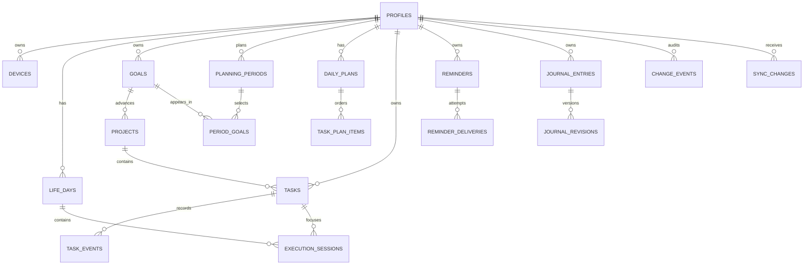

# Database

Last updated: 2026-07-18
Status: Phase 1A schema and Phase 1B authenticated Today read migrations are local-only and validated against the local Supabase stack. No hosted project or external connection has been created.

## Phase 1B read boundary

`20260718010000_add_today_read_rpcs.sql` adds `get_current_life_day`, `get_today_tasks`, and `get_today_snapshot`. Each is executable only by `authenticated`, performs an explicit `auth.uid()` check, uses a fixed search path, and returns a safe JSON read model. No new table grants or RLS policies are added; direct lifecycle writes remain denied and must use the existing command RPCs.

## Phase 1A implemented schema

`20260717010000_add_life_day_today_foundation.sql` adds the following local-only tables:

- `life_days`: explicit wake/sleep boundaries, wake and sleep IANA zones, revisions, and a partial unique index that permits only one open row per user.
- `tasks`: optional Life Day link, title/description, required V1 priority, lifecycle status, optional scheduled UTC instant plus zone, estimate, position, revisions, and structured cancellation data.
- `task_events`: append-only created/updated/completed/rescheduled/cancelled records with structured reason fields where required.
- `command_operations`: an operation-id idempotency ledger with a request hash and safe stored result.
- `change_events`: append-only, redacted field-change audit metadata.
- `sync_changes`: an ordered, user-scoped invalidation/change cursor. It does not implement sync pull, a device cursor, or a mobile outbox.

Every new table has RLS enabled. User-owned projections have authenticated owner-only select policies; direct writes are intentionally not granted. `command_operations` is completely hidden from direct clients. Only authenticated command RPCs make lifecycle writes.

The migration uses the wake command's validated IANA zone to derive `operational_date`. A sleep command changes only `slept_at` and its source zone; it never changes the Life Day because midnight passed. Naps have no command or schema effect. A repair command is the only way to close a forgotten prior sleep with a stated reason.

Close and repair commands reject while the Life Day still has planned or in-progress tasks. The caller must first use an explicit task command to reschedule, mark overdue, or cancel them; no implicit task copy, date change, or rollover is created.

## Technology and conventions

Supabase Postgres is the authoritative database. Supabase Auth owns `auth.users`; application tables live in a controlled application schema, with only intentionally safe read views/functions exposed to the client Data API. Use repository-owned SQL migrations, not dashboard-only schema changes.

Conventions:

- Primary keys: UUID generated server-side where possible; clients may generate IDs only for offline-created entities and must use collision-safe UUIDs.
- All user-owned rows have `user_id uuid not null references auth.users(id)` and RLS enabled.
- Use `timestamptz` for instants, `date` for user-facing calendar dates, IANA zone names in `text`, and preserve local wall-clock values for reminders.
- All mutable aggregates have `revision bigint not null default 1`, `created_at`, `updated_at`, and optional `deleted_at`. Revisions advance only in the accepted server command transaction.
- Use `citext` only where case-insensitive uniqueness is required; otherwise use `text` with explicit length checks.
- Use `jsonb` only for bounded extensibility/metadata, not core relationships or queryable columns.
- Avoid polymorphic foreign keys in core integrity paths. Use explicit nullable foreign keys plus `CHECK` constraints where a record can belong to one of a small set of parents.
- Generic history payloads contain redacted field metadata; journal full text belongs only in revision rows.

## Entity overview

| Entity                                       | Purpose                                                         | Lifecycle / owner                 |
| -------------------------------------------- | --------------------------------------------------------------- | --------------------------------- |
| `profiles`                                   | User preferences, home time zone, privacy/notification defaults | one per Auth user                 |
| `devices`                                    | Registered web/mobile installation and sync state               | many per user; deactivatable      |
| `life_days`                                  | Wake-to-sleep operational days                                  | many per user; at most one open   |
| `goals`                                      | Long-term outcomes and target state                             | many per user; soft-deletable     |
| `projects`                                   | Finite initiatives that advance goals                           | many per user; optional goal link |
| `planning_periods`                           | Monthly/weekly planning windows                                 | many per user/period kind         |
| `period_goals`                               | Goals selected for a monthly/weekly period                      | many per period                   |
| `daily_plans`                                | Task-selection plan for a calendar/Life Day                     | one per user/operational date     |
| `tasks`                                      | Work items and lifecycle state                                  | many per user; optional links     |
| `task_plan_items`                            | Ordered placement of tasks in a daily plan                      | many per daily plan               |
| `task_events`                                | Immutable task lifecycle events                                 | many per task                     |
| `execution_sessions`                         | Optional focused-work sessions                                  | many per user; linked task/day    |
| `reminders`                                  | Canonical reminder schedule and intent                          | many per user                     |
| `reminder_deliveries`                        | Attempts, receipts, acknowledgement                             | many per reminder                 |
| `journal_entries` / `journal_revisions`      | Private reflection with version history                         | many per user / entry             |
| `attachments`                                | Authorized metadata for private stored files                    | many per user/entry               |
| `progress_metrics` / `progress_measurements` | Defined measurable outcomes and observations                    | many per goal/project             |
| `change_events`                              | Append-only user-visible/audit history                          | many per user                     |
| `sync_operations` / `sync_changes`           | Idempotency ledger and pull feed                                | many per device/user              |

## Relationships

## Proposed tables

Column lists name the material fields; every application table also uses the conventions above unless noted.

### Identity and devices

#### `profiles`

| Column                     | Type  | Constraints                                       | Meaning                                  |
| -------------------------- | ----- | ------------------------------------------------- | ---------------------------------------- |
| `id`                       | uuid  | PK, FK `auth.users(id)`                           | user identity                            |
| `home_timezone`            | text  | non-empty IANA zone, default chosen at onboarding | calendar/Life Day policy zone            |
| `day_start_policy`         | text  | enum: `wake_time` initially                       | records agreed Life Day rule             |
| `notification_preferences` | jsonb | bounded schema/default `{}`                       | channels/quiet-hours defaults, no tokens |
| `privacy_preferences`      | jsonb | bounded schema/default `{}`                       | local cache/AI consent choices           |

#### `devices`

| Column             | Type        | Constraints                          | Meaning                             |
| ------------------ | ----------- | ------------------------------------ | ----------------------------------- |
| `id`               | uuid        | PK, client-generated allowed         | stable installation id              |
| `user_id`          | uuid        | FK, indexed                          | owner                               |
| `platform`         | text        | enum: `ios`, `android`, `web`        | platform                            |
| `label`            | text        | nullable, length-limited             | user-visible device name            |
| `push_provider`    | text        | nullable                             | `expo`, `web_push`, future provider |
| `push_token`       | text        | nullable, encrypted/protected access | opaque delivery token; never log    |
| `last_sync_cursor` | bigint      | not null default 0                   | acknowledged user sync cursor       |
| `last_seen_at`     | timestamptz | nullable                             | active-device/tombstone decisions   |
| `deactivated_at`   | timestamptz | nullable                             | no longer receive deliveries        |

Unique active token constraint: `(push_provider, push_token)` where token is not null and device is active. Do not make provider tokens searchable outside delivery code.

### Time, goals, projects, and plans

#### `life_days`

| Column                         | Type        | Constraints                     | Meaning                              |
| ------------------------------ | ----------- | ------------------------------- | ------------------------------------ |
| `id`                           | uuid        | PK                              | operational day                      |
| `user_id`                      | uuid        | FK, indexed                     | owner                                |
| `operational_date`             | date        | not null                        | date assigned by agreed wake policy  |
| `timezone`                     | text        | not null                        | zone used to derive operational date |
| `woke_at`                      | timestamptz | not null                        | recorded wake instant                |
| `slept_at`                     | timestamptz | nullable; `slept_at >= woke_at` | recorded sleep instant               |
| `wake_source` / `sleep_source` | text        | enum                            | user/manual/import provenance        |
| `notes`                        | text        | nullable, length-limited        | short non-journal operational note   |

Partial unique index: `unique (user_id) where slept_at is null and deleted_at is null`. This enforces one open Life Day. Multiple historical days may share an operational date only if product policy explicitly allows correction; otherwise add `unique (user_id, operational_date)` for closed/open active rows.

#### `goals`

| Column          | Type        | Constraints                                 | Meaning                     |
| --------------- | ----------- | ------------------------------------------- | --------------------------- |
| `id`, `user_id` | uuid        | PK / owner FK                               | identity and owner          |
| `title`         | text        | not blank, bounded                          | outcome label               |
| `description`   | text        | nullable                                    | supporting context          |
| `status`        | text        | `active`, `paused`, `completed`, `archived` | lifecycle                   |
| `target_date`   | date        | nullable                                    | user intent, not a reminder |
| `completed_at`  | timestamptz | nullable                                    | closure instant             |
| `position`      | numeric     | nullable                                    | stable UI sort key          |

#### `projects`

| Column                           | Type        | Constraints                       | Meaning                    |
| -------------------------------- | ----------- | --------------------------------- | -------------------------- |
| `id`, `user_id`                  | uuid        | PK / owner FK                     | identity and owner         |
| `goal_id`                        | uuid        | nullable FK `goals`               | goal advanced by project   |
| `title`, `description`, `status` | text        | as for goals                      | project identity/lifecycle |
| `start_date`, `target_date`      | date        | nullable; target not before start | intent                     |
| `completed_at`                   | timestamptz | nullable                          | closure                    |

`goal_id` must reference a goal with the same `user_id`; enforce in a trigger/command function because a simple FK cannot express tenant equality.

#### `planning_periods`

| Column                 | Type | Constraints                      | Meaning               |
| ---------------------- | ---- | -------------------------------- | --------------------- |
| `id`, `user_id`        | uuid | PK / owner FK                    | identity and owner    |
| `kind`                 | text | `month` or `week`                | period horizon        |
| `starts_on`, `ends_on` | date | not null; `ends_on >= starts_on` | inclusive local dates |
| `timezone`             | text | not null                         | zone used at creation |
| `status`               | text | `draft`, `active`, `closed`      | planning lifecycle    |

Unique `(user_id, kind, starts_on)` prevents duplicate canonical periods. Week start day is a profile/product decision and must be consistent before creation.

#### `period_goals`

| Column       | Type    | Constraints                                 | Meaning                          |
| ------------ | ------- | ------------------------------------------- | -------------------------------- |
| `id`         | uuid    | PK                                          | selection record                 |
| `period_id`  | uuid    | FK `planning_periods`                       | containing month/week            |
| `goal_id`    | uuid    | FK `goals`                                  | selected long-term goal          |
| `project_id` | uuid    | nullable FK `projects`                      | optional selected project        |
| `title`      | text    | not blank                                   | period-specific intended outcome |
| `position`   | numeric | not null                                    | ordered priority                 |
| `status`     | text    | `planned`, `active`, `completed`, `dropped` | lifecycle                        |

Unique `(period_id, goal_id, project_id)` with a normalized null handling strategy. Tenant consistency is enforced by command function.

#### `daily_plans`

| Column             | Type | Constraints                 | Meaning                    |
| ------------------ | ---- | --------------------------- | -------------------------- |
| `id`, `user_id`    | uuid | PK / owner FK               | identity/owner             |
| `operational_date` | date | not null                    | date the plan represents   |
| `life_day_id`      | uuid | nullable FK `life_days`     | attached when a day exists |
| `timezone`         | text | not null                    | date interpretation        |
| `status`           | text | `draft`, `active`, `closed` | plan lifecycle             |

Unique active `(user_id, operational_date)` is recommended. Do not auto-create it on wake until a product decision confirms that behavior.

### Tasks and execution

#### `tasks`

| Column                  | Type        | Constraints                                                               | Meaning                               |
| ----------------------- | ----------- | ------------------------------------------------------------------------- | ------------------------------------- |
| `id`, `user_id`         | uuid        | PK / owner FK                                                             | identity/owner                        |
| `title`                 | text        | not blank, bounded                                                        | action label                          |
| `description`           | text        | nullable                                                                  | task context                          |
| `status`                | text        | `planned`, `in_progress`, `completed`, `overdue`, `cancelled`, `archived` | current state                         |
| `priority`              | text        | `non_negotiable`, `progress`, `maintenance`                               | V1 execution priority                 |
| `life_day_id`           | uuid        | nullable FK `life_days`                                                   | optional Today/Life Day container     |
| `scheduled_at`          | timestamptz | nullable with IANA zone                                                   | intended scheduled instant            |
| `scheduled_timezone`    | text        | nullable; paired with `scheduled_at`                                      | zone associated with scheduled intent |
| `completed_at`          | timestamptz | nullable                                                                  | accepted completion instant           |
| `completed_life_day_id` | uuid        | nullable FK                                                               | day on which completed                |
| `estimated_minutes`     | integer     | positive, nullable                                                        | optional estimate                     |
| `position`              | numeric     | not null                                                                  | stable Today ordering                 |

Check status/time consistency: completed tasks require `completed_at`; non-completed tasks must not claim it. Allow parent/child tasks only in a later migration after completion semantics are specified.

#### `task_plan_items`

| Column            | Type    | Constraints                      | Meaning             |
| ----------------- | ------- | -------------------------------- | ------------------- |
| `daily_plan_id`   | uuid    | FK                               | plan                |
| `task_id`         | uuid    | FK                               | task placed in plan |
| `position`        | numeric | not null                         | explicit order      |
| `planned_minutes` | integer | positive, nullable               | allocation          |
| `state`           | text    | `planned`, `deferred`, `removed` | placement state     |

Primary/unique key `(daily_plan_id, task_id)`. The task and plan must share `user_id`.

#### `task_events` and `execution_sessions`

`task_events` currently records `created`, `updated`, `completed`, `rescheduled`, and `cancelled` with `occurred_at`, operation references, optional `life_day_id`, structured reschedule/cancellation reason fields, and compact metadata. It is append-only. Execution events are deferred with task sessions.

`execution_sessions` holds explicit focused work: `user_id`, `task_id`, `life_day_id`, `started_at`, nullable `ended_at`, nullable `paused_at`, `status`, and `note`. Add a partial unique constraint for one active session per user only if the product requires exclusive focus.

### Reminders, journals, and attachments

#### `reminders`

| Column               | Type        | Constraints                                  | Meaning                         |
| -------------------- | ----------- | -------------------------------------------- | ------------------------------- |
| `id`, `user_id`      | uuid        | PK / owner FK                                | identity/owner                  |
| `task_id`            | uuid        | nullable FK                                  | optional task target            |
| `title`              | text        | not blank                                    | visible reminder label          |
| `schedule_kind`      | text        | `once` initially; recurrence deferred        | schedule behavior               |
| `local_date`         | date        | nullable                                     | local scheduled date            |
| `local_time`         | time        | nullable                                     | wall-clock intent               |
| `timezone`           | text        | not null                                     | zone for wall-clock calculation |
| `next_fire_at`       | timestamptz | nullable, indexed                            | calculated server occurrence    |
| `channel`            | text        | `mobile_push`, `in_app`, future `web_push`   | preferred route                 |
| `status`             | text        | `active`, `paused`, `completed`, `cancelled` | lifecycle                       |
| `quiet_hours_policy` | jsonb       | bounded                                      | defer/suppress rule             |

No free-form recurrence rule in the first schema. Add a validated RFC 5545 recurrence model only after rollover/DST product behavior is agreed.

#### `reminder_deliveries`

Holds `reminder_id`, `device_id`, `scheduled_for`, `attempted_at`, `provider`, `provider_message_id`, `status` (`queued`, `sent`, `provider_accepted`, `failed`, `acknowledged`, `suppressed`), `failure_code`, and `acknowledged_at`. Unique `(reminder_id, device_id, scheduled_for, channel)` prevents duplicate claim/send. Never store notification body in a provider receipt.

#### `journal_entries` and `journal_revisions`

`journal_entries` contains owner, optional `life_day_id`, optional goal/project/task links, `current_revision_id`, entry date/time zone, soft-delete, and revision metadata. It does not hold mutable body text.

`journal_revisions` contains `id`, `entry_id`, monotonic `revision_number`, `body` (sensitive text), optional `title`, `created_at`, `author_user_id`, `source_operation_id`, and optional `restored_from_revision_id`. Unique `(entry_id, revision_number)`; only a command function may move `current_revision_id`. Retention/redaction requirements determine whether bodies are encrypted client-side in a future phase.

#### `attachments`

Contains owner, optional `journal_entry_id`, bucket/path, original filename, media type, byte count, checksum, upload status, and soft-delete. Storage path must be non-guessable and private; access is by authorized signed URL. Enforce size/type limits before upload.

### Progress, history, and sync

#### `progress_metrics` and `progress_measurements`

`progress_metrics` defines one measurable indicator for exactly one goal or project: title, unit, target value, direction (`increase`, `decrease`, `boolean`), baseline, and aggregation rule. Use `CHECK ((goal_id is null) <> (project_id is null))`.

`progress_measurements` records immutable observations: metric, observed value, observed at, optional Life Day/task/period link, source (`manual`, `task_event`, `import` future), and note. Current progress is an indexed view/query over measurements plus task events; do not maintain opaque client counters.

#### `change_events`

Append-only history: `id`, `user_id`, `entity_type`, `entity_id`, `event_type`, `operation_id`, `device_id`, `actor_user_id`, `occurred_at`, `server_recorded_at`, `from_revision`, `to_revision`, `summary jsonb`, and `correlation_id`. `summary` must exclude journal bodies, attachment paths, tokens, and secrets. Use a database role/trigger policy to prevent update/delete outside approved retention/redaction procedures.

#### `sync_operations` and `sync_changes`

`sync_operations` is the idempotency ledger: `operation_id` PK, user/device ids, command type/schema version, client timestamp, base revision, request fingerprint, accepted/rejected/conflict status, canonical result reference, and server timestamp. Retain long enough to cover offline retry windows.

`sync_changes` is a user-scoped pull feed: `cursor bigint generated always as identity`, `user_id`, entity type/id, change type (`upsert`, `tombstone`), revision, operation id, server time, and a bounded canonical payload or hydration key. Unique `(user_id, cursor)` and indexed cursor access. Clients must be able to request a full snapshot when a cursor expires.

## Invariants and authorization

- An authenticated user can access only rows whose `user_id = auth.uid()`; RLS applies to tables and exposed views.
- Foreign-key-linked user-owned rows must share their owner. Enforce through command functions or tenant-consistency triggers.
- One open Life Day per user; sleep cannot precede wake; closing twice is idempotent only for the same operation/result.
- One canonical weekly/monthly period per user/kind/start date; weekly convention is immutable once periods exist.
- No accepted command changes an entity without incrementing its revision, writing history, and producing a sync change.
- `operation_id` is globally unique and belongs to one user/device/command fingerprint; reuse with a different body is rejected.
- Soft deletion writes a tombstone and history/sync change. Hard deletion happens only in an explicit privacy-retention job with a recovery policy.
- All reminder sending claims are unique/idempotent; a scheduled job must not send twice merely because it retries.

## Indexes and query patterns

| Query pattern                          | Index / mechanism                                                                               |
| -------------------------------------- | ----------------------------------------------------------------------------------------------- |
| Today: current Life Day and daily plan | partial `(user_id) where slept_at is null`; `(user_id, operational_date)` on daily plans        |
| Tasks for today/project/status         | `(user_id, status, due_on)`; `(project_id, status)`; task plan item `(daily_plan_id, position)` |
| Weekly/monthly planning                | `(user_id, kind, starts_on)` on periods; `(period_id, position)` on period goals                |
| Active reminders due now               | partial `(next_fire_at) where status = 'active' and deleted_at is null`                         |
| Delivery claims                        | unique delivery key plus `(status, scheduled_for)`                                              |
| Journal timeline                       | `(user_id, entry_date desc)` and `(entry_id, revision_number desc)`                             |
| User history / entity history          | `(user_id, server_recorded_at desc)` and `(entity_type, entity_id, server_recorded_at desc)`    |
| Sync pull                              | `(user_id, cursor)` and `(device_id, status)` on operations                                     |
| Progress chart                         | `(metric_id, observed_at desc)`                                                                 |

Use `EXPLAIN (ANALYZE, BUFFERS)` with realistic user-scoped data before adding indexes. Partition high-volume append-only tables (`change_events`, `sync_changes`, `reminder_deliveries`, perhaps `task_events`) by time only after measured growth; premature partitioning complicates RLS and migrations.

## Migration policy

Migrations follow expand → backfill → verify → switch → contract:

1. Add additive schema, indexes concurrently where supported, RLS policies, and dual-read/dual-write compatibility.
2. Backfill in resumable batches with operation/correlation logging; do not lock large tables in one transaction.
3. Verify row counts, constraint validity, RLS policy tests, sync snapshot compatibility, and rollback/roll-forward behavior in staging.
4. Switch application reads/writes only after all supported clients understand the new schema or server adapters translate it.
5. Contract/remove old fields only after the minimum supported mobile client version and offline outbox TTL have passed.

Every destructive or privacy-sensitive migration needs an explicit recovery plan, approved backup policy, and release window. Never run a production migration under this planning task.

## Backup, retention, and recovery decisions required

Supabase-managed backups are not a complete product retention policy. Before release, decide and document:

- target RPO/RTO and plan tier/backup coverage;
- retention/archival windows for audit, sync, delivery, task-event, and journal-revision records;
- whether a user can purge journal revisions or must redact them cryptographically;
- export format and deletion verification; and
- how long inactive device cursors block tombstone cleanup.

Run restore drills against non-production data before declaring recovery supported.

## Security checklist for schema review

- Enable RLS on every client-exposed table/view and test owner/non-owner/no-session paths.
- Put internal tables and privileged helpers in a non-exposed schema; expose narrow `security_invoker` views where needed.
- Grant only required `SELECT/INSERT/UPDATE/DELETE/EXECUTE` permissions; review every `SECURITY DEFINER` function for fixed search path and tenant checks.
- Use the Supabase publishable key only in clients; service-role/secrets only in Edge Function/server environments.
- Do not put private journal content, storage paths, tokens, or raw provider receipts in logs, generic audit events, analytics, or notification bodies.
