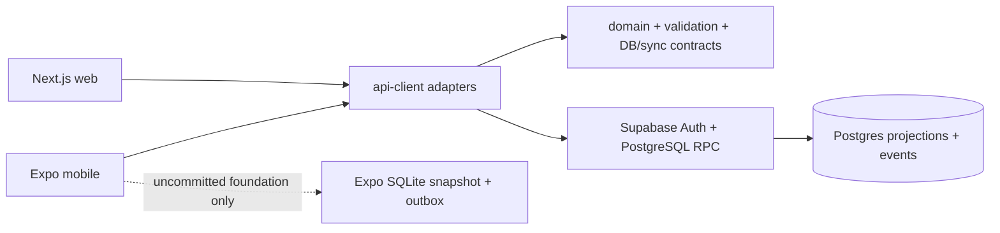

# Project Handoff

Last inspected: 2026-07-28

## Evidence boundary

This handoff distinguishes the committed repository from the current working tree. The latest commit is `9314643` (`feat: add planner mode and task management`). The working tree also contains uncommitted Phase 1D-A mobile SQLite/outbox work. Treat that work as in progress until it is reviewed, validated, and committed.

## Product purpose and intended workflow

Personal OS is a private, single-user web and mobile workspace for translating long-term intent into daily execution and later reflection. The product plan ultimately includes goals, projects, planning horizons, Life Days, tasks, journaling, reminders, progress, history, and opt-in AI insights.

The currently implemented daily workflow is narrower:

1. A person signs up or signs in with local Supabase email/password auth.
2. They start a Life Day explicitly with “I’m Awake.”
3. They view Today in Execution Mode, then enter Planner Mode when they need to create, edit, order, prioritise, schedule, select Top 3, or resolve tasks.
4. Task mutations go through authenticated command RPCs with an operation ID and expected revision.
5. Before sleeping, planned/in-progress tasks must be explicitly rescheduled, kept overdue, or cancelled with a structured reason.
6. The person explicitly closes the Life Day with “I’m Going to Sleep.” A missed sleep requires repair; midnight and naps do not change a Life Day.

## Product requirements represented in the repository

- One private owner per workspace; collaboration is not implemented.
- UTC instants plus IANA time zones for Life Day and scheduled task timestamps.
- One open Life Day per user; no inferred sleep or automatic rollover.
- Task priorities: `non_negotiable`, `progress`, and `maintenance`.
- Revision-aware, idempotent task and Life Day commands.
- No more than three active Top 3 tasks per Life Day, enforced in the database command layer.
- Redacted audit/change events and sync-change hints for accepted commands.
- Mobile offline capability is a V1 product requirement, but only a local Phase 1D-A foundation exists in the uncommitted working tree; end-to-end offline behavior is not implemented.

## Technology stack

| Area | Implemented technology |
| --- | --- |
| Monorepo | pnpm 11 workspaces and Turborepo |
| Web | Next.js 16 App Router, React 19, TypeScript |
| Mobile | Expo SDK 57, React Native, Expo Router, TypeScript |
| Shared contracts | Framework-free TypeScript packages and Zod 4 schemas |
| Backend | Local Supabase CLI, PostgreSQL 15, Auth, SQL RPC functions, pgTAP |
| Testing | Vitest and local Supabase pgTAP tests |
| Formatting/linting | Prettier 3 and ESLint 10 with `typescript-eslint` |

`pnpm-workspace.yaml` uses pnpm 11 `allowBuilds` and explicitly denies the optional `sharp` native build. Revisit that decision before introducing `next/image`, standalone hosting, or self-hosted image optimization.

## Monorepo architecture

`apps/*` may depend on `packages/*`; packages must not import application code. The base TypeScript configuration is strict and enables exact optional properties, unused-code checks, and unchecked-index protection.



## Web architecture

- `apps/web/app/page.tsx` renders the client-side Today surface.
- `apps/web/app/planner/page.tsx` reuses that surface with Planner Mode enabled.
- `apps/web/app/today-client.tsx` currently owns sign-in/up/out, session restoration, Today loading, Life Day commands, task/planner controls, and basic conflict messaging in one large client component.
- `apps/web/lib/supabase.ts` exposes a browser-only `globalThis` singleton. The web adapter test covers repeated access returning the same client, preventing duplicate GoTrue clients.
- `/api/health` validates public web configuration and returns a basic health response.

Web has no offline cache/outbox, realtime subscription, notification, or server-rendered authenticated data flow.

## Mobile architecture

- Expo Router entry is configured by `apps/mobile/package.json`; `app/_layout.tsx` contains the root Stack and `app/index.tsx` is the only product screen.
- The screen is currently online-only: it restores the Supabase session, uses typed adapters, supports the Today/Planner interactions, and has a Planner Mode toggle rather than a distinct Planner route.
- `apps/mobile/lib/supabase.ts` creates an independent module-level Supabase client. Session persistence and device ID use Expo SecureStore.
- The uncommitted Phase 1D-A files add Expo SQLite storage, a local command engine, and an isolated outbox processor. The screen does not import or invoke them, so users cannot yet submit commands offline.

SQLite is not encrypted at rest. No service-role or secret key is configured in mobile code.

## Shared package responsibilities

| Package | Responsibility |
| --- | --- |
| `@personal-os/domain` | Branded IDs, UTC/IANA time types, revisions, Life Day/task rules, planner grouping |
| `@personal-os/validation` | Zod schemas for public configuration, credentials, Today read payloads, and all command inputs/results |
| `@personal-os/database-contracts` | TypeScript read contracts for profiles, Life Days, tasks, and Today snapshots |
| `@personal-os/sync-contracts` | Command result/error and sync-change contracts |
| `@personal-os/api-client` | Sole import site for `@supabase/supabase-js`; typed auth, Today-read, Life Day, and task RPC adapters |
| `@personal-os/config` | Public web/mobile environment parsing and required-configuration guard |
| `@personal-os/utils` | Framework-free assertion utilities |

## Supabase and database architecture

Local Supabase is the only configured backend. `supabase/config.toml` names a local project and has no hosted-project reference. Local email/password sign-up is enabled and email confirmation is disabled only for local development.

The migrations create:

- `profiles`, automatically created for each Auth user.
- `life_days` and `tasks` as user-owned state projections.
- `command_operations` for idempotency, intentionally inaccessible to direct clients.
- `task_events` and redacted `change_events` for history.
- `sync_changes` as a cursor-hint table, not a proven full replication API.

RLS is enabled for all user-owned tables. Life Day/task/event writes are command-only: authenticated users execute narrowly granted `SECURITY DEFINER` RPC functions, and every meaningful command claims an operation, validates ownership/revision/invariants, mutates projections, writes events/change hints, and stores a safe result transactionally. One deliberate exception exists: the profile migration grants an owner direct `UPDATE` on `profiles`; that path does not automatically advance the profile revision and should be reviewed before new profile features rely on revision semantics.

## Authentication and API/RPC architecture

Clients use the public/publishable Supabase key only. The auth adapter validates email/password input, wraps Supabase session operations, and exposes a subscription cleanup function.

Read RPCs:

- `get_current_life_day`
- `get_today_tasks`
- `get_today_snapshot`

Command RPCs:

- `command_start_life_day`, `command_close_life_day`, `command_repair_previous_life_day`
- `command_create_task`, `command_update_task`, `command_complete_task`, `command_reschedule_task`, `command_cancel_task`
- `command_reorder_task`, `command_set_task_top_three`, `command_reopen_task`, `command_resolve_unfinished_task`

The adapter validates every request and response with shared schemas. No direct `.from(...).insert/update/delete` application call was found in the inspected app/package sources.

## Offline and synchronization architecture

Facts:

- Committed web and mobile product flows are online-only.
- The database writes sync-change hints, and `sync-contracts` defines an upsert-shaped change type.
- No client cursor-pull adapter, realtime subscription, or end-to-end conflict UI is present.
- The uncommitted Phase 1D-A files add a user-scoped SQLite Today snapshot, command outbox fields, conflicts/sync metadata, temporary task-ID mapping, and a testable local command engine.
- `command_create_task` generates the server task ID. The local engine records a temporary task ID and a dependency on its create operation, but acknowledgement replacement and dependent-payload rewriting are not integrated.

Therefore, offline synchronization is only partially designed/implemented and must not be represented as a working user feature.

## Environment variable names

Examples contain placeholders only. Required public names are:

- `APP_ENV`
- `NEXT_PUBLIC_APP_ENV`
- `NEXT_PUBLIC_APP_URL`
- `NEXT_PUBLIC_SUPABASE_URL`
- `NEXT_PUBLIC_SUPABASE_PUBLISHABLE_KEY`
- `EXPO_PUBLIC_APP_ENV`
- `EXPO_PUBLIC_SUPABASE_URL`
- `EXPO_PUBLIC_SUPABASE_PUBLISHABLE_KEY`

Never put a service-role key in an app environment file or client bundle.

## Development and verification commands

Use Node 22 LTS and pnpm 11.10+; on restricted Windows PowerShell, use `pnpm.cmd`.

```text
pnpm install
pnpm supabase:start
pnpm supabase:reset
pnpm supabase:test
pnpm --filter @personal-os/web dev
pnpm --filter @personal-os/mobile start
pnpm format:check
pnpm lint
pnpm typecheck
pnpm test
pnpm build:web
pnpm validate:mobile
python scripts/verify.py
```

`python scripts/verify.py` runs format, lint, TypeScript, tests, web production build, and Android Expo export. GitHub Actions performs a frozen install and then that command for pull requests.

## Important decisions already made

- Supabase Postgres is the authoritative system of record; SQL migrations are repository-owned.
- Life Days are explicit wake/sleep boundaries; midnight and naps do not close a day.
- Mutations use idempotent command RPCs with expected revisions rather than direct CRUD.
- Planner Mode is a product interaction mode, never an authorization boundary.
- Top 3 and Life Day closure invariants are enforced by the database.
- Journal content must not appear in generic audit logs; E2EE and AI are deferred.
- Web offline support and web push are deferred.
- Recurrence, collaboration, goals/projects, reminders, journals, analytics, export/import, and AI remain later phases.

## Known limitations and risks

- The checked-in `AGENTS.md` calls Phase 1B the current objective, while commits/documentation/code show Phase 1C and an uncommitted Phase 1D-A attempt. Resolve that governance drift before further implementation.
- `sync_changes` is present but there is no implemented cursor-pull RPC. Do not treat it as a complete event log or replication protocol.
- `README.md` still describes no mobile SQLite/outbox, while uncommitted files and current-status documentation describe Phase 1D-A. The correct present-state wording is “uncommitted, unintegrated local foundation.”
- The large web/mobile screen components are difficult to test and maintain; no component/UI tests were found.
- Local SQLite rows are not encrypted at rest; sign-out/account-switch clearing is not wired into the mobile screen.
- There is no local proof in this handoff that migrations/tests/builds still pass. See `IMPLEMENTATION_STATUS.md` for the current verification blocker.
- `personal-os-context.zip` is untracked and should be reviewed deliberately; it is not part of the application source map.
